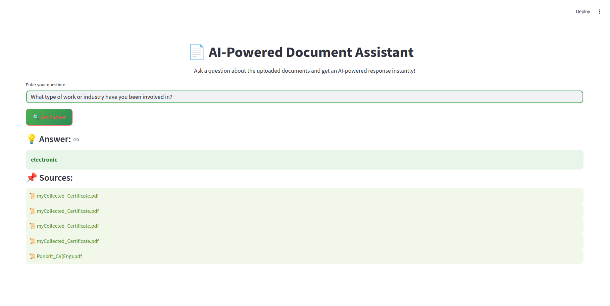

# A6 NLP Assignment - Let's talk yourself (RAG-based Chatbot) 🧠🤖

---

## 📜 Assignment Details

https://github.com/PK-124960/A6_NLP_assignment.git

- **Course:** AT82.05 - Artificial Intelligence: Natural Language Understanding (NLU)
- **Assignment:** A6 - Let's talk yourself
- **Instructor:** Chaklam Silpasuwanchai, Todsavad Tangtortan
- **Objective:** Implement a **Retrieval-Augmented Generation (RAG)** chatbot that can retrieve relevant information from personal documents and generate meaningful responses.
- **Deadline:** One-week assignment
- **Deliverables:**
	- GitHub repository with Python implementation (app.py).
	- **README.md** (this document).
	- Web application (web.py).

---
## 🚀 Project Overview
  This project implements a Retrieval-Augmented Generation (RAG) chatbot using LangChain, FAISS, and OpenAI GPT-3.5. The chatbot is designed to answer questions based on personal documents such as transcripts, certificates, and a CV.

## 🎯 Features
✅ **Document-Based Q&A** - The chatbot retrieves relevant information from uploaded documents.
✅ **FAISS Vector Search** - Uses FAISS for efficient similarity-based document retrieval.
✅ **GPT-3.5 Turbo Integration** - Generates responses based on retrieved documents.
✅ **Streamlit UI** - Can be extended with a web-based interface.
✅ **Built with LangChain** - Modular and scalable NLP pipeline.

---

## 📸 Screenshots

### 🏙️ Example 1: How old are you?

### 💬 Example 2: What is your highest level of education?

### 🍕 Example 3: What major or field of study did you pursue during your education?

### 🐍 Example 4: How many years of work experience do you have?

### 🏙️ Example 5: What type of work or industry have you been involved in?

### 💬 Example 6: Can you describe your current role or job responsibilities?

### 🍕 Example 7: What are your core beliefs regarding the role of technology in shaping society?

### 🐍 Example 8: How do you think cultural values should influence technological advancements?

### 🍕 Example 9: As a master’s student, what is the most challenging aspect of your studies so far?

### 🐍 Example 10: What specific research interests or academic goals do you hope to achieve during your time as a master’s student?

---

